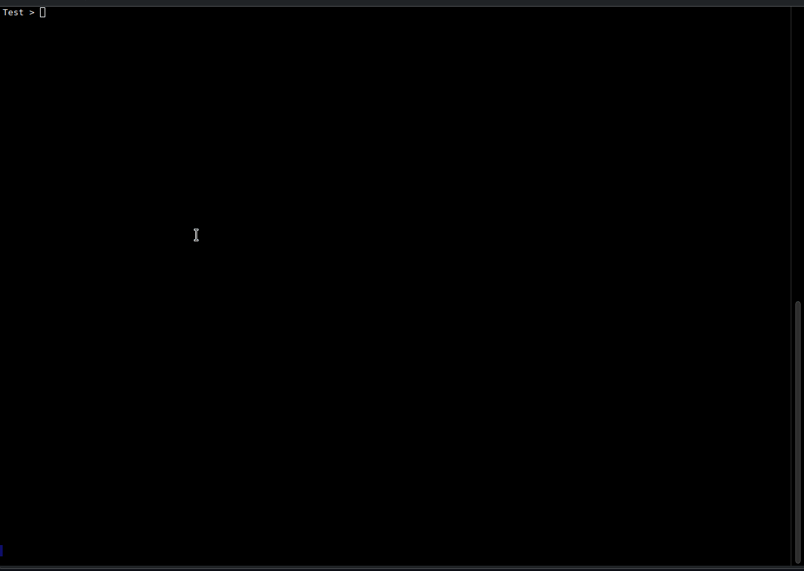
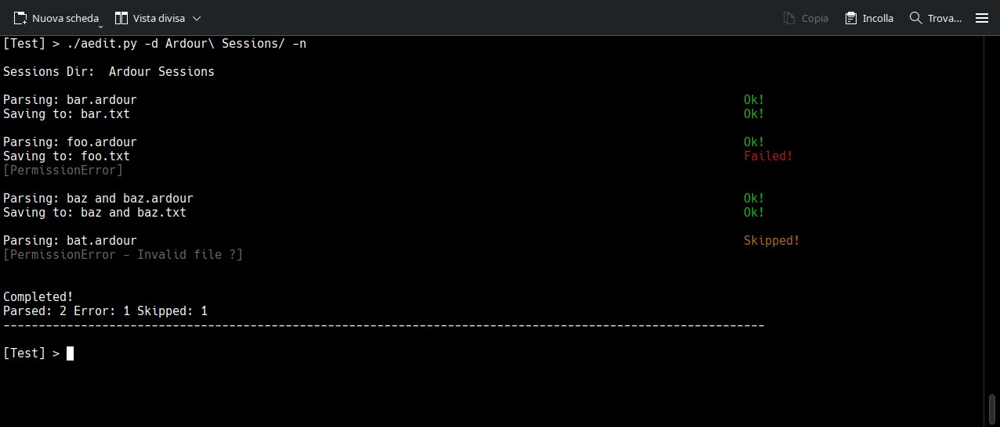
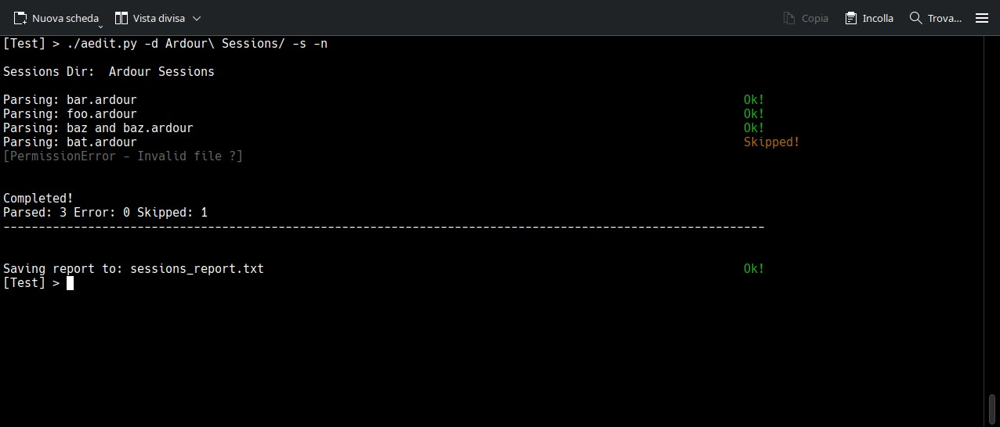

# aedit.py

A python script useful for creating reports about Ardour sessions. Mainly for listing plugin.\
It can also remove plugins from ardour session file. This features is <ins>primarily for testing/debugging\
broken plugins</ins> so you don't have to load a session in Safe Mode to remove these plugins.\

Keep in mind that I'm not a developer, just a guy who occasionally dabbles with Python and other things.\
No AI, just a bit of spaghetti :)

## INSTALLATION:
It's just a script...\
On linux you can put it somewhere in your path (EG /usr/local/bin)\
or just run the script with ./aedit.py after a chmod +x aedit.py.\

## USAGE:
**Run the script with no arguments:**\
you can load a session file  (*.ardour)\
With a file loaded, you can save a report, list/remove plugins and **REWRITE** the session file.\
Plugins are divided by track.\
Original file will be saved as *.save\
You can also review the changes before saving.\
There's no UNDO system. In doubt, quit without rewriting the session file!

**Arguments:**\
-i/--info: show basic system info

-f/--file: /path/to/*.ardour file

load *.ardour file.

-d/--dir: /path/to/your sessions_dir

scan session dir and create a report for each project.\
Existing report will be overwritten.

-s/--save: save report.

In conjunction with -f save a report for that project.\
In conjunction with -d save a **single** report for all your projects, inside your sessions dir.

-n/--nopath:

For some sort of privacy, hide the full path of yours projects/files.\
Only the file name or session dir name will be shown.\
Valid for screen and reports.

In this screenshot, multiple reports with error handling.\
"Failed" because missing write permission.\
"Skipped" may happen when session file is not valid, readable or does not match\
the pattern project_dir/project.ardour (Eg: mysong/mysong.ardour)

Here with single report

(Some screenshots may not be updated to the latest version)

## BUGS:
Hopefully not too many ;)\
Text alignment and justification are hardcoded.\
So with a very long path or with a very long track name,\
there could be some ugliness, sorry. It will be addressed in feature releases.\
-n switch may help with long path a/o long session name.

## REQUIREMENTS:
Python >= 3.9 (maybe 3.8, Not sure 'cause I'm on Python 3.13)\
Probably any Operative System with Python.\
Developed and tested on Linux (openSUSE TW) and Windows 10.\
Also available as exe file created with pyinstaller on Windows 10.\
It also works on Windows 11 but little tested here.\
WARNING! Not being certified, windows 11 will block the program from running.\
So 3 options here:
1) Install Python and use the script
2) run the exe anyway, despite Windows rants (maybe antivirus software too)
3) Do nothing and go out for a walk :)\
Choose your poison ;)

## PERFORMANCE:
Here on openSUSE TW, with a Ryzen 5700x - 16Mb RAM - ssd\
less then 4 sec for parsing 80 Sessions.
