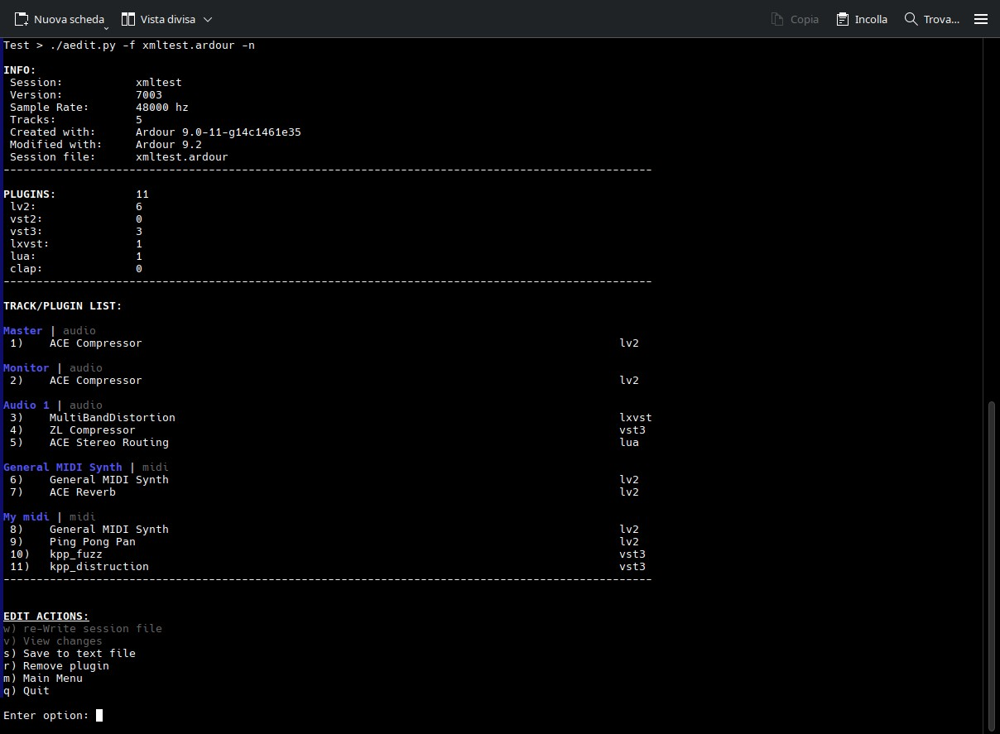

# aedit.py

A python script useful for creating reports about Ardour sessions. Mainly for listing plugin.\
It can also remove plugins from ardour session file. This features is <ins>primarily for testing/debugging\
broken plugins</ins> so you don't have to load a session in Safe Mode to remove these plugins.\

Keep in mind that I'm not a developer, just a guy who occasionally dabbles with Python and other things.\
No AI, just a bit of spaghetti :)

### INSTALLATION:
It's just a script...\
On linux you can put it somewhere in your path (EG /usr/local/bin)\
or just run the script with ./aedit.py

### USAGE:
**Run the script with no arguments:**\
you can load a session file  (*.ardour)\
With a file loaded, you can save a report, list/remove plugins and **REWRITE** the session file.\
Plugins are divided by track.\
Original file will be saved as *.save\
You can also review the changes before saving.\
There's no UNDO system. In doubt, quit without rewriting the session file!\

**Arguments:**\
-f/--file: /path/to/*.ardour file

load *.ardour file.

-d/--dir: /path/to/your sessions_dir

scan session dir and create a report for each project.\
Existing report will be overwritten.

-s/--save: save report.

In conjunction with -f save a report for that project.\
In conjunction with -d save a **single** report for all your projects, inside your sessions dir.

-n/--nopath:

For some sort of privacy, hide the full path of yours projects/files.\
Only the file name or session dir name will be shown.\
Valid for screen and reports.\

### BUGS:
Hopefully not too many ;)\
Text alignment and justification are hardcoded.\
So with a very long path or with a very long track name,\
there could be some ugliness, sorry. It will be addressed in feature release.\

### REQUIREMENTS:
Python >= 3.9 (maybe 3.8, Not sure 'cause I'm on Python 3.13)\
Probably any Operative System with Python.\
Tested only on Linux (openSUSE TW) and Windows 10
